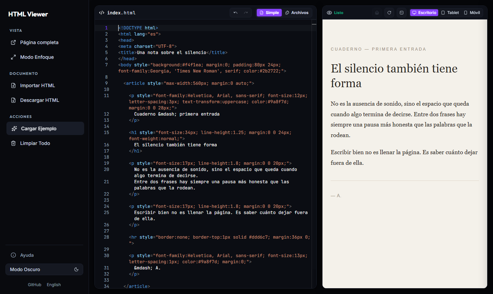
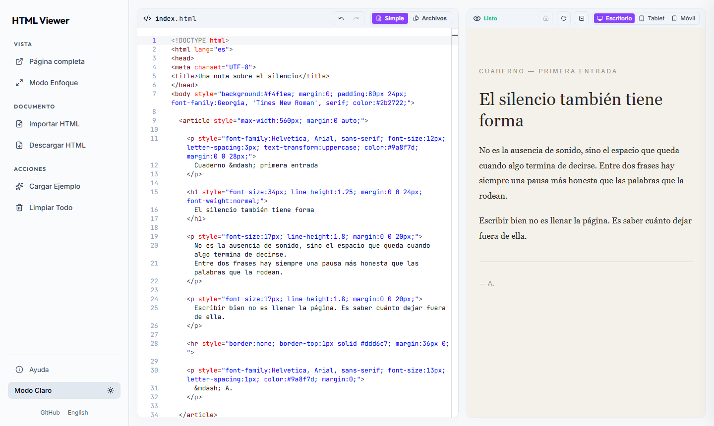
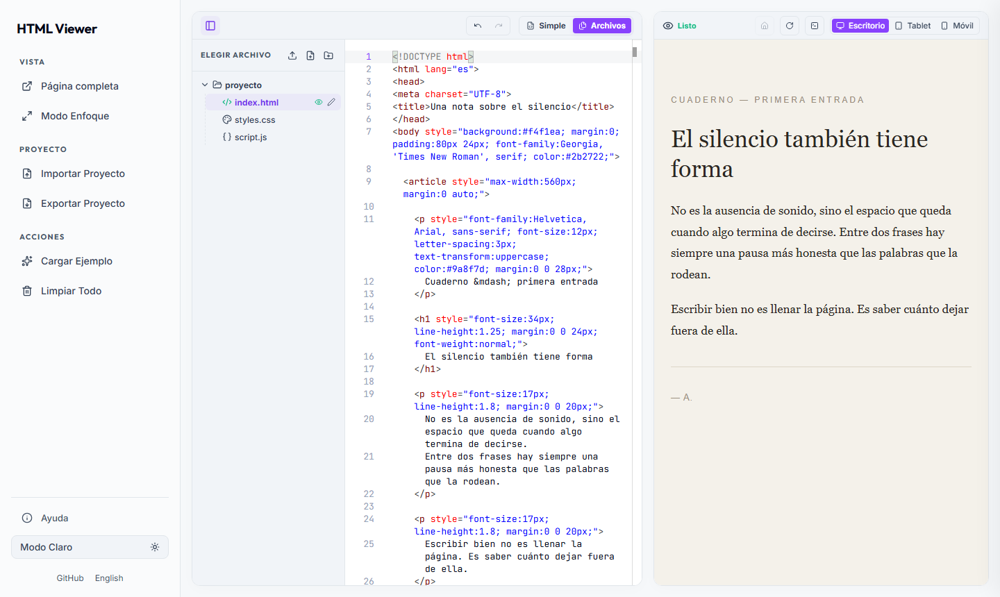

# HTML Viewer

Editor estático de HTML, CSS y JavaScript con vista previa en el navegador.
Incluye modo Simple y proyectos con archivos, importación HTML/ZIP, exportación,
deshacer/rehacer, tema claro/oscuro, español/inglés y recuperación local.

Los archivos se procesan localmente. La aplicación no incluye analítica,
publicidad, cuentas ni servicios de backend. El código y los recursos que abras
en la vista previa pueden hacer sus propias peticiones a Internet.



| Modo claro | Modo Archivos |
| --- | --- |
|  |  |

## Ejecutar

Necesitas Node.js 24 y npm para construir y probar el proyecto.

```sh
npm ci
npm run build
npm run preview
```

Abre <http://127.0.0.1:8000>. El alojamiento solo necesita servir los archivos
de `dist/`; no necesita Node.js. No edites `dist/`, se regenera en cada build.
El modo Archivos requiere HTTPS o localhost para su Service Worker.

## Publicar en GitHub

1. Sube el proyecto a un repositorio público. Se incluyen las fuentes, pruebas,
   recursos locales y licencias; `.gitignore` excluye dependencias, compilaciones,
   variables de entorno y configuraciones locales.
2. En **Settings → Pages → Build and deployment**, elige **GitHub Actions**.
3. El workflow `Publish GitHub Pages` construye, verifica y publica `dist/` al
   subir cambios a `main`. También puedes iniciarlo desde **Actions**.

Las rutas del editor funcionan en un dominio raíz y en
`https://usuario.github.io/repositorio/`. El workflow configura automáticamente
la ruta de retorno del 404 mediante `BASE_PATH`. Si compilas manualmente para
una subcarpeta, define `BASE_PATH=/nombre-del-repositorio` durante el build.

La configuración sigue el [workflow oficial de GitHub Pages](https://docs.github.com/en/pages/getting-started-with-github-pages/using-custom-workflows-with-github-pages).
GitHub Pages sirve el sitio sin aplicar `_headers`; la verificación también
prueba esa configuración. `netlify.toml` permite publicar el mismo `dist/` en Netlify.

## Desarrollo y pruebas

```sh
npm run dev
npx playwright install chromium
npm test
npm run test:dist
```

`npm run dev` sirve el directorio de trabajo. Después de editar las fuentes,
ejecuta `npm run build` para regenerar los archivos que carga el navegador.
`test:dist` comprueba ambos idiomas, Monaco, HTML/ZIP, historial, recursos y
navegación de proyectos, ayuda y móvil; también monta la aplicación en una
subcarpeta sin cabeceras especiales para reproducir GitHub Pages.
GitHub Actions ejecuta las pruebas en cada push y pull request.

- `src/app/`: lógica del editor y vista previa.
- `src/site/editor-shell.html`: estructura compartida del editor.
- `build-site.mjs`: editor en inglés/español y página 404.
- `styles.css`, `layout.css`: estilos editables.
- `preview-sw.js`: servidor virtual de proyectos dentro del navegador.
- `assets/`: Monaco, fuentes y licencias locales.
- `vendor/`: bibliotecas originales utilizadas por el build.
- `public-files.mjs`: lista explícita de archivos que se publican.
- `scripts/`, `tests/`: servidor local y comprobaciones de desarrollo.

`index.html`, `es/index.html`, `404.html`, `app.bundle.js`, `*.min.css`,
`lucide.min.js` y `jszip.min.js` son archivos generados.

## Licencia

El código del proyecto se publica con licencia [MIT](LICENSE).
Las dependencias conservan sus licencias; consulta [THIRD-PARTY-NOTICES.md](THIRD-PARTY-NOTICES.md).
